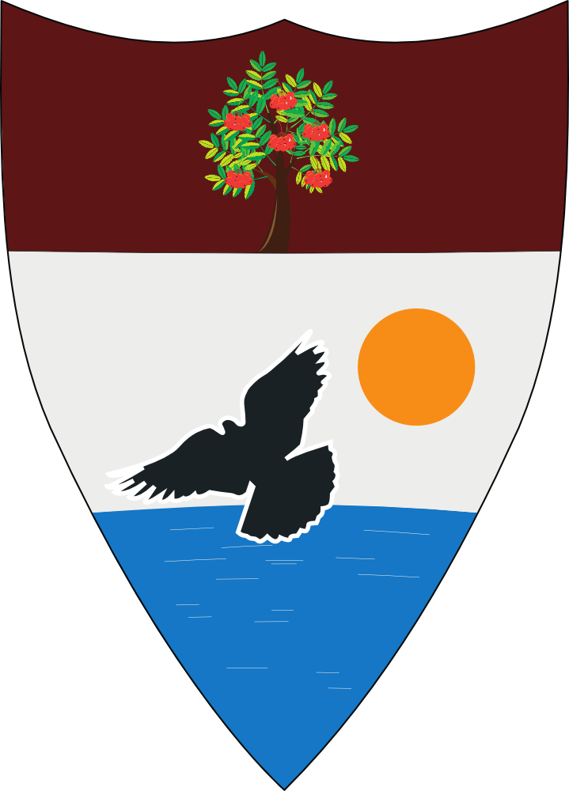

<p>
<center>
# Liberland Blockchain
  
</center>
</p>


[](https://github.com/liberland/liberland_node/tags) [](https://twitter.com/liberland)


## Install and Run   

For Linux, OpenBSD, FreeBSD and MacOS:

```sh
curl --proto '=https' --tlsv1.2 -sSf https://sh.rustup.rs | sh
git clone https://github.com/liberland/liberland_node && cd liberland_node/
sh scripts/init.sh
cargo build --release
```


More documentation can be found in the (docs/)[docs/] folder


